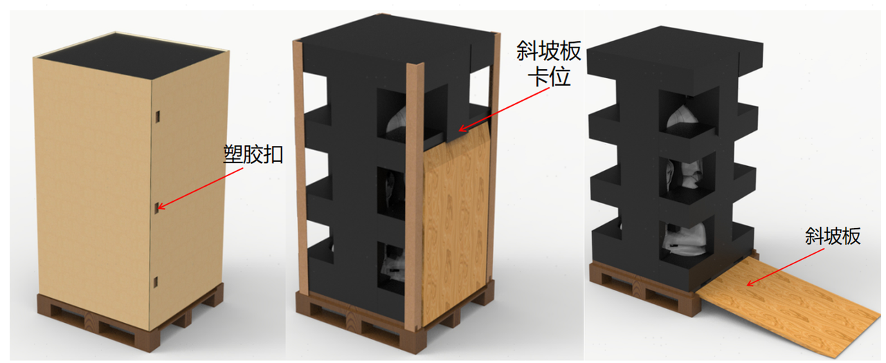
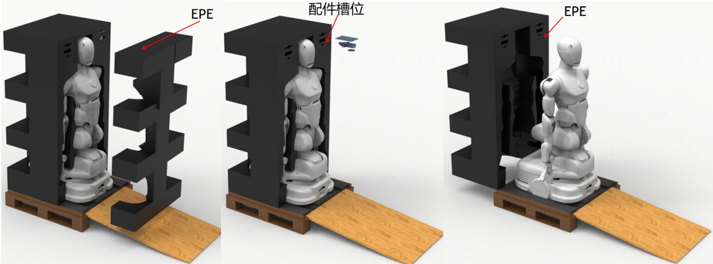

import { Steps } from '@astrojs/starlight/components';
import { Aside } from '@astrojs/starlight/components';
import { Image } from 'astro:assets';

您好，欢迎使用 AlphaBot 2 机器人！本文将引导您完成开箱、上电等基本操作，带您轻松上手，走近这位即将并肩工作的新搭档。

<Aside type="caution">
在开始前，请仔细阅读[安全条例](/statement/safety-regulations)和[免责声明](/statement/disclaimer)。
</Aside>

## 开箱

在收到 AlphaBot 2 包装箱后，请按照以下步骤进行开箱：

import getting_started_1 from 'img/getting-started-1.png';
import getting_started_2 from 'img/getting-started-2.png';

<Steps>

1. 请检查包装箱，并确定箱体完好无损。机器人使用瓦楞纸箱和木托包装，尺寸如下图所示。
   <Aside>
    若箱体有破损，请及时与我司及物流公司联系。
   </Aside>
   <Image src={getting_started_1} alt="" width="250"/>

2. 剪开外部热熔带，并取下顶盖。
   <Image src={getting_started_2} alt="" width="200"/>

3. 按住塑胶扣，将包装侧边围板拆卸开并取下。打开斜坡板卡位，放下斜坡板。
   

4. 先取下前侧 EPE 保护内衬，将配件从配件槽中取出，随后取下后侧 EPE 保护内衬，之后将机器人从斜坡板推下，放置于平坦的地面上。
   <Aside>
   - 配件包括 2 个夹爪、1 个螺丝刀、若干螺丝、发货清单，可能还包含其他配件（如备用线），请以实物为准。
   - 请妥善保管好包装箱及包装材料，以便后续运输或维护使用。
   </Aside>

   

5. 请检查机器人主体及配件是否有明显的损坏或缺陷，如有请及时与我司联系。

</Steps>

## 开机

在完成开箱后，请按照以下步骤开机：

{/* 1. 将电源适配器连接到机器人背部的电源接口上，确保连接牢固。
    */}

<Steps>

1. 在底盘处，长按 `开关` 键 1.5s，机器人上电，按钮全亮代表上电成功。
   

2. 在等待 1 分钟后，机械臂末端的蓝/绿按钮点亮，代表机械臂上电成功，随后便可开始使用机器人。
       

</Steps>

接下来请参阅[硬件介绍](../architecture)了解 AlphaBot 2 的硬件结构与相关参数，或跳转到[常用操作](../operation-guide)开始使用机器人完成各种任务。