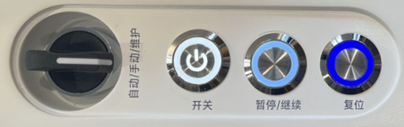
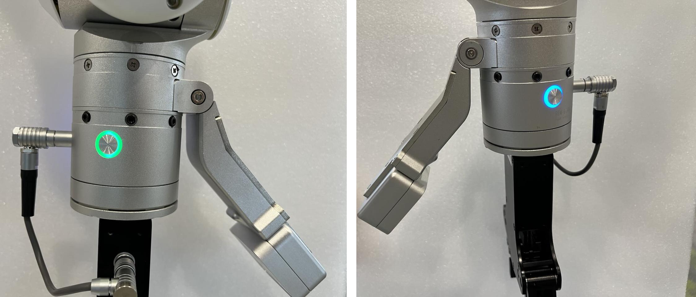

import { Steps } from '@astrojs/starlight/components';
import { Aside } from '@astrojs/starlight/components';
import { Image } from 'astro:assets';

Hello and welcome to using the AlphaBot 2 robot! This guide will walk you through basic operations such as unboxing and power-on, helping you get started easily and get to know your new partner that will work alongside you.

<Aside type="caution">
Before you begin, please carefully read the [safety regulations](/en/alphabot2/hardware/safety-regulations) and [disclaimer](/en/statement/disclaimer).
</Aside>

## Unboxing

After receiving the AlphaBot 2 packaging box, follow the steps below to unbox it:

import getting_started_1 from 'img/getting-started-1.png';
import getting_started_2 from 'img/getting-started-2.png';

<Steps>

1. Inspect the packaging box and ensure it is intact. The robot is packaged in a corrugated carton with a wooden pallet, and its dimensions are shown in the figure below.
   <Aside>
    If the box is damaged, please contact our company and the logistics company immediately.
   </Aside>
   <Image src={getting_started_1} alt="" width="250"/>

2. Cut the external hot-melt tape and remove the top cover.
   <Image src={getting_started_2} alt="" width="200"/>

3. Press the plastic buckles, disassemble and remove the side coaming of the packaging. Open the ramp plate clamp and lower the ramp plate.
   

4. Remove the front EPE protective inner liner. Take the accessories out of the accessory slot. Then remove the rear EPE protective inner liner. Roll the robot down the ramp panel and place it on a flat ground surface.
   <Aside>
   - Accessories include 2 grippers, 1 screwdriver, several screws, and a packing list. Additional accessories (e.g., spare cables) may also be included. Refer to the actual product for accuracy.
   - Retain the packaging box and materials for future transportation or maintenance.
   </Aside>

   

5. nspect the main robot body and accessories for any visible damage or defects. If any issues are found, contact our company promptly.

</Steps>

## Power-On

After completing the unboxing procedure, follow the steps below to power on the robot:

<Steps>

1. At the chassis, press and hold the power button for 1.5 seconds to power on the robot. All buttons lighting up indicates successful power-on.
   

2. After waiting for 1 minute, the blue/green button at the end of the robotic arm lights up, indicating that the robotic arm is successfully powered on, and then you can start using the robot.
       

</Steps>

Next, please refer to the [Hardware Introduction](../architecture) to learn about the hardware structure and related parameters of AlphaBot 2, or jump to [Common Operations](../operation-guide) to start using the robot to complete various tasks.